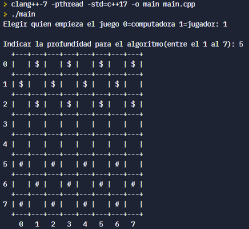
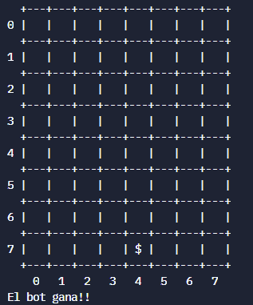

# Damas
Clasico juego de Damas con el algoritmo minimax 

# Como ejecutar
- Para ejecutar solo es necesario compilar y ejecutar el main.cpp

### Funcionamiento 🔧
- Elegir la profundidad para nuestro árbol de desiciones
- Elegir la fila y columna inicial
- Elegir la fila y columna final

